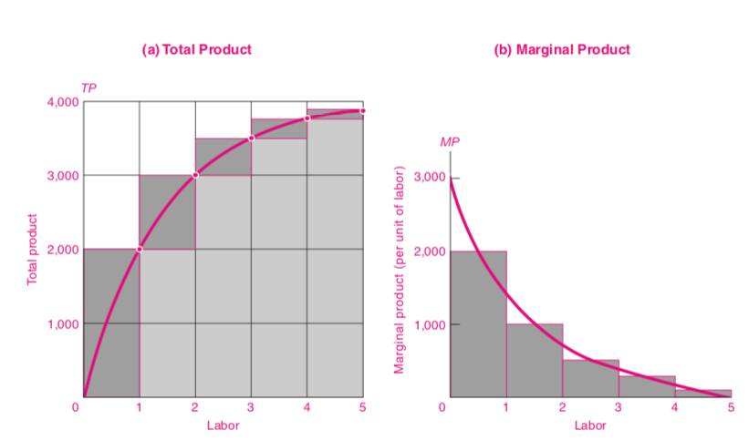

```{r setup, include=FALSE}
options(htmltools.dir.version = FALSE)
knitr::opts_chunk$set(
	echo = FALSE,
	fig.height = 3.5,
	fig.retina = 3,
	fig.width = 6,
	message = FALSE,
	warning = FALSE,
	cache = FALSE,
	dev = "png",
	dev.args = list(type = "cairo-png"),
	hiline = TRUE,
	out.width = "100%"
)
library(tibble)
library(ggplot2)
library(showtext)
library(purrr)
library(kableExtra)
library(tibble)
library(emo)
library(dplyr)
library(ggplot2)

font_add_google("Lato", "Lato")
font_add_google("Merriweather", "Merriweather")
theme_set(theme_minimal(base_family = 'Lato', base_size=16))

```

```{r xaringan-themer, include=FALSE, warning=FALSE}
library(xaringanthemer)


colores <- c(celeste="#5e82ae", 
             color3="#89a2c3",
             color1="#698BB4",
             color2="#5D81AD",
             verde="#4E7B7B")

# ,,5D81AD,,000000
style_mono_accent(
  base_color = "#5e82ae",
  #secondary_color = "",
  header_font_google = google_font("Lato"),
  text_font_google   = google_font("Merriweather"),
)
```


<style>

.center2 {
  margin: 0;
  position: absolute;
  top: 50%;
  left: 50%;
  -ms-transform: translate(-50%, -50%);
  transform: translate(-50%, -50%);
}


.remark-slide-content {

 height: 200px;
}

li {
  margin-bottom: 20px;
}

</style>


# Las capacidades productivas de la sociedad

- Dependen de 
  - Fuerza laboral
  
  - Stock y calidad del capital (maquinaria, edificios, etc.)
  
  - Las capacidades tecnológicas
  
  - Las instituciones.


- La __estructura productiva__ de una economía. 

  - ¿Qué es?
  
  - Uruguay en el siglo XIX vs hoy.
  
  - Uruguay vs. Japón.

---

# Las empresas

- Son las unidades productivas, compran __inputs__ en un mercado y producen __outputs__.

  
---
# Maximización de beneficios

¿Qué desean los empresarios? 

- ¿Vender lo más posible? `r emo::ji("x")`

- ¿Gastar lo menos posible? `r emo::ji("x")`

- Ganar las mayores ganancias posibles. `r emo::ji("white_check_mark")`

---

# Algunos conceptos

- __Producto Total__. Es la cantidad producida para determinado nivel de input.

- __Producto Marginal__. Es la cantidad extra que produce la última unidad de input que uso.

- __Producto Medio__. Es la cantidad de output por unidad de producto.

<!-- --- -->

<!-- # Ejemplo Numérico -->

<!-- | Input  |  Producto Total |Producto Marginal   |Producto Medio   | -->
<!-- |---|---|---|---| -->
<!-- |  0 |  0 | -  | -   | -->
<!-- | 1  |  2000 |2000   |  2000 | -->
<!-- | 2  |  3000 |1000   |1500   | -->
<!-- | 3  |  3500 |500   |1167   | -->
<!-- | 4  |  3800 |300   |950   | -->
<!-- | 5  |  3900 |100   |780   | -->


---
# La función de producción

Relaciona la cantidad de inputs con el output.

- $F(K, L) = Y$

- $F(L)  = Y$

---
# Función de Producción





---
# Rendimientos Marginales Decrecientes

- ¿Qué son? 

- Vamos a suponer que las empresas tienen rendimientos marginales decrecientes __a partir de cierto nivel de producción__.

---
# Retornos a escala

- ¿Qué pasa cuando cambio todos los inputs a la vez?

- Si $F(2*K, 2*L) = 2*Y$ tengo rendimientos __constantes__ a escala.

- Si $F(2*K, 2*L) > 2*Y$ tengo rendimientos __crecientes__ a escala.

- Si $F(2*K, 2*L) < 2*Y$ tengo rendimientos decrecientes a escala.


---
# Cambio tecnológico

- El bienestar económico de las sociedades depende de su capacidad de incorporar mejoras en la producción.


---
# Medición de la productividad


- Producto por trabajador

- Productividad multifactorial


---
# Costos

- Las empresas incurren en costos para producir.

- Sus decisiones dependen de las curvas de costos que enfrentan, porque los costos impactan en los beneficios.

- Analizamos varias curvas de costos y el __costo de oportunidad__.

---
# Plazos cortos y largos.

- En el corto plazo solo se ajustan factores __variables__.

- En el largo plazo se ajustan __todos los factores productivos__.

---
# Costo Fijo y Variable

- Son funciones de la cantidad producida $q$.

- Los costos fijos no dependen de la cantidad producida, los variables si.


---
# Ejemplo

| q  |CF   |CV   |CT   |
|---|---|---|----|-----|
|  0 |55   |0     | 55  |
| 1  |55   |30    | 85  |
| 2  |55   |55    | 110  |
| 3  |55   |75    | 130  |
| 4  |55   |105   | 160  |
| 5  |55   |155   | 210  |
| 6  |55   |225   | 280  |


---
# Costo Marginal

- Es el costo de producir una unidad extra.

- Ejemplo de costo marginal bajo:
  - Software
  
  - Aerolíneas
  
- Ejemplo de costo marginal alto

  - Electricidad con alta demanda.
  
  
---
# Ejemplo numérico

| q  |  CT |MC   |
|----|---|---|
| 0  |55   |   |
| 1  |85   |30   |
| 2  |110   | 25  |
| 3  |130   | 20  |
| 4  |160   | 30  |
| 5  |210   | 50  |  
---
# Costo Medio

Es el costo promedio por unidad:

$$CMe = \frac{CT}{q}$$

---
# Costo Fijo Medio, Costo Variable Medio

- $CFMe=\frac{CF}{q}$

- El Costo Fijo medio cae porque cuanto más produzco, divido ese costo fijo entre más unidades.


- $CVMe=\frac{CV}{q}$

- La forma de la curva de Costo variable depende de la productividad de los factores variables.


---
# Costos Medios, Fijos y Marginales


---
# Costos Medios, Fijos y Marginales (2)

- El Costo Fijo Medio decrece cuando aumentamos la cantidad producida.

- Los Costos Medios y Marginales tienen forma de U por la productividad marginal (creciente al principio y decreciente después).

- Si el costo marginal es menor que el costo medio, la última unidad fue más __barata__ que el promedio. Eso hace que el costo medio __baje__.

- Si el costo marginal es mayor que el costo medio, la última unidad fue más __cara__ que el promedio. Eso hace que el costo medio __suba__.

- Si el costo marginal es igual al costo medio, el costo medio está en un extremo, ni sube ni baja.


---


---
# Costos Fijos Medios, Costos Variables Medios y Costos Marginales Medios.

| q |CF   |CV    |CT   |
|---|-----|-----|------|
| 0 |55   |0    | 55   |
| 1 |55   |30   | 85   |
| 2 |55   |55   | 110  |
| 3 |55   |75   | 130  |
| 4 |55   |105  | 160  |
| 5 |55   |155  | 210  |
| 6 |55   |225  | 280  |

---

.pull-left[

### Productividad marginal y costos

- La forma de la curva de costos depende de la productividad marginal.

- Si hay un factor fijo (capital), al __principio__ la productividad marginal crece a medida que aumentamos el factor variable (trabajo).

- Eso implica que le costo marginal baja.

- Luego de que llegamos a cierto nivel, el factor fijo se satura, y la productivdad marginal empieza a caer.

- Esto hace que los costos marginales suban.
]

.pull-right[

]

---

.pull-left[

### Costos y maximización de beneficio

- El beneficio se maximiza cuando la distancia entre el ingreso total (IT) y el costo total (CT) es mayor.
]
.pull-right[

]

